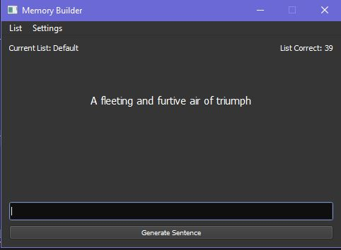
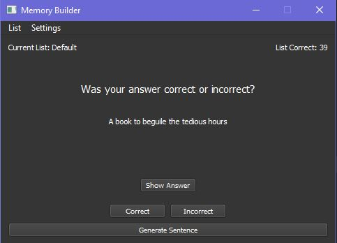
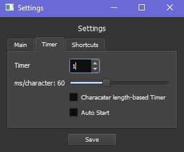
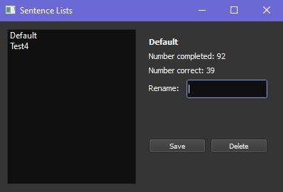

# Memory Builder

This is an application for enhancing iconic memory, or simply improving quick judgment/memorization. 
Import a list of sentences from a text file and generate random sentences from the list for which you have a matter of seconds to remember and recall the sentence.
Customize the timer and typing mode to practice the way you want.

## Features

- Import sentences from a text file
- Customize the timer or use a timer based on number of characters in a sentence
- Practice in typing or no-typing mode
- Keep track of number of correct sentences
- Automatically generate sentences

## Screenshots

## Code

Written in Python with PyQt5 for the GUI.